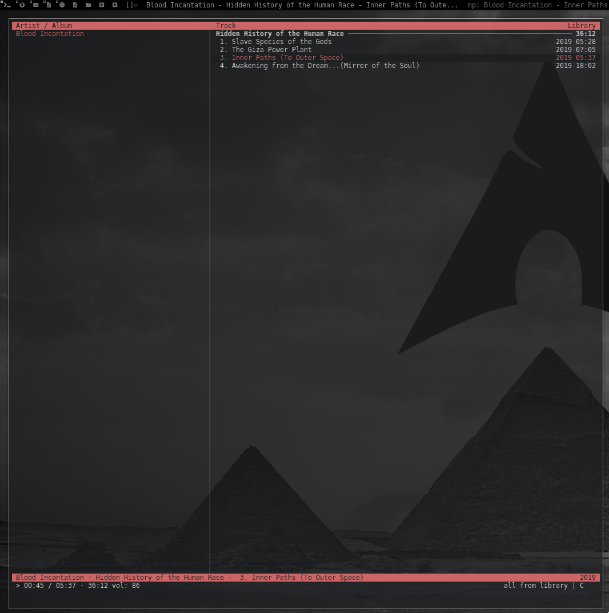
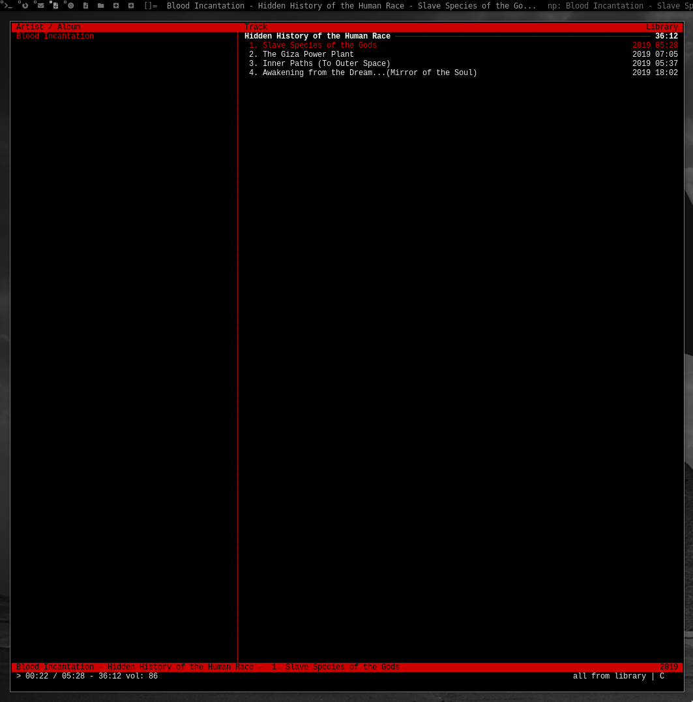

# cmus-deathmetal
Dark color scheme for cmus music player.

Installation:
Place deathmetal.theme in cmus directory.
Example:
~/.config/cmus/

Load theme in cmus:
:colorscheme deathmetal

Screenshot Alacritty with transparency

Screenshot ST no transparency

